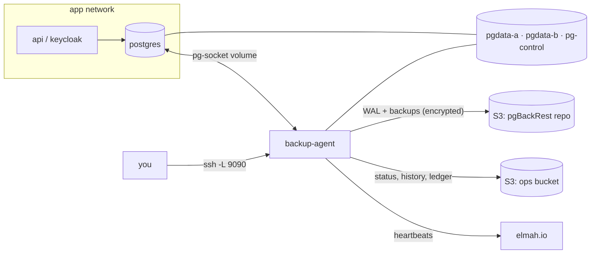

# Backup agent and break-glass console

A container that sits next to Postgres and owns everything backup-related: it streams WAL into a pgBackRest repo, takes daily backups, restores a throwaway copy every week to prove the backups work, and serves a small web console for restoring when things go wrong. The console runs on `127.0.0.1:9090` on the server, so you reach it over an SSH tunnel. It needs nothing from the app (no Keycloak, no API, no app database), so it still works when all of those are down.

This README covers what it does, where everything is, and how to move it to another project. The incident runbook is [docs/RESTORE.md](../../docs/RESTORE.md). The design decisions are in [the ADR](../../docs/adr/postgres-backup-agent.md) and [task 60](../../tasks/60-backup-console.md).

## What you get

- **15-minute RPO.** WAL streams continuously over a replication slot. On quiet nights the agent forces a WAL switch every 5 minutes, so no more than about 15 minutes of data can be lost.
- **Point-in-time restore** to any minute in the last 14 days, to "just before migration X", or to a backup as it was.
- **A restore never touches live.** It goes into the other of two data volumes (A/B), gets checked, and only goes live when a person clicks **Go live** and redeploys. The old volume stays for forensics until you delete it.
- **Backups can't take Postgres down.** Postgres has no `archive_command`. If pgBackRest, S3 or the agent breaks, the result is a WAL gap and an alert, never a full disk.
- **Weekly drill.** Every Sunday the agent restores the newest backup into tmpfs, checks it against live, and throws it away. Restore time (RTO) is tracked per drill.
- **Alerts through elmah.io heartbeats:** WAL (carries overall health every 5 minutes), backup, verify, drill. A quarterly manual drill that is overdue also raises an alert.
- **History** of every run, action and checklist tick, in the console and in an S3 ops bucket. No row content is ever stored, only names and counts.

## Pinned versions

| Component | Version | Why it's pinned |
|---|---|---|
| Postgres | 17 (`postgres:17`) | A physical restore needs the same major on both sides. The agent image is built `FROM postgres:17` for `pg_receivewal`, `pg_ctl` and the throwaway restore server. Both Dockerfiles take `PG_MAJOR`; change them together. Postgres 18 images moved the default data directory, so 18 needs a test pass, not just a bump. |
| pgBackRest | 2.59.x | Installed from the PGDG apt repo at build time (2.59.3 when tested). Pin it with `pgbackrest=<version>` in the agent Dockerfile if you need reproducible builds. |
| .NET | 10 | The agent is a self-contained `linux-x64` publish, so the runtime ships in the image. |

## How it fits together



- The agent is **not** on the app network. It reaches Postgres only through the shared Unix socket, as the role `backup_agent` with peer authentication. Nothing reaches the agent except `127.0.0.1:9090` on the host.
- **Two data volumes, one marker.** Both containers mount `pgdata-a` at `/pgdata/a` and `pgdata-b` at `/pgdata/b`, plus `pg-control` at `/pg-control`. Postgres's entrypoint ([select-volume.sh](../postgres/select-volume.sh)) reads `/pg-control/active` (`a` or `b`) and starts on that directory. The agent asks Postgres which directory it runs on (`data_directory`) and only ever writes to the other one.
- **Go live** writes the spare's letter to the marker. Then **Redeploy** in Dokploy (`up -d --force-recreate`) restarts everything, and Postgres comes up on the restored volume with the API and Keycloak fresh behind it. No environment variable changes. Switch back works the same way.
- The paths must be identical in both containers, because pgBackRest refuses a `pg1-path` that differs from the server's `data_directory`. The agent passes `--pg1-path` per call, since the live volume changes.

## Where things are

**[`infrastructure/postgres/`](../postgres/)**: the Postgres image. It has no backup tooling.

| File | What it does |
|---|---|
| [Dockerfile](../postgres/Dockerfile) | `postgres:17` plus our config, the init script and the volume-picking entrypoint |
| [select-volume.sh](../postgres/select-volume.sh) | Entrypoint. Sets `PGDATA` from `/pg-control/active`, refuses to `initdb` an empty volume once the marker exists, then runs the stock `docker-entrypoint.sh` |
| [postgresql.conf](../postgres/postgresql.conf) | `wal_level=replica`, slots, `max_slot_wal_keep_size=4GB`, `archive_mode=off`, `track_commit_timestamp=on` |
| [pg_hba.conf](../postgres/pg_hba.conf), [pg_ident.conf](../postgres/pg_ident.conf) | Peer auth on the socket for `backup_agent` only (OS user `postgres`, uid 999, maps to it). Everyone else needs a password, on the socket too |
| [initdb/10-roles.sh](../postgres/initdb/10-roles.sh) | Creates the app and Keycloak databases and roles, the `backup_agent` role with its grants, and the `backup_agent_heartbeat` table in the `postgres` database |

**`infrastructure/backup-agent/`** (this folder): the agent.

| File | What it does |
|---|---|
| [Dockerfile](Dockerfile) | `postgres:17` + pgBackRest + the .NET agent, runs as uid 999 |
| [pgbackrest.conf](pgbackrest.conf) | S3 repo, AES-256 encryption, `repo1-retention-full=13` with daily fulls, `archive-check=n`. Secrets come from `PGBACKREST_*` env vars |
| [Program.cs](Program.cs) | Wiring, security headers (CSP, antiforgery) |
| [AgentOptions.cs](AgentOptions.cs) | Every setting, bound from `Agent__*`, `OpsBucket__*` and `Heartbeats__*` env vars |
| [WalStreamer.cs](WalStreamer.cs) | Runs `pg_receivewal` into the `wal-receive` volume, pushes finished segments with `archive-push`, handles lost slots, new timelines and go-live detection |
| [Scheduler.cs](Scheduler.cs) | The 1-minute tick: status every 5 minutes, then the due job (requested full, daily full, weekly verify, weekly drill). Mirrors the deletion ledger and migration times to the ops bucket |
| [BackupService.cs](BackupService.cs) | Backup, expire, verify and the drill |
| [RestoreService.cs](RestoreService.cs) | The restore wizard, go-live, cancel, switch back, delete old volume, resurrected-school detection |
| [DrillChecks.cs](DrillChecks.cs) | The checks a drill and a restore run against the restored copy |
| [DataVolumes.cs](DataVolumes.cs) | Which volume is live and which is spare, and the marker file |
| [PgBackRest.cs](PgBackRest.cs) | The pgBackRest CLI wrapper, repo listing, restorable ranges |
| [Postgres.cs](Postgres.cs) | Live queries (as `backup_agent`) and the throwaway restore server |
| [Status.cs](Status.cs) | Health and issues. This is what the heartbeat and `status.json` carry |
| [OpsBucket.cs](OpsBucket.cs) | `status.json`, `history/`, `ledger.json`, `migrations.json` in S3, and the elmah.io heartbeats |
| [Pages/](Pages/) | The console: server-rendered HTML, no JavaScript framework |
| [docker-compose.dev.yml](docker-compose.dev.yml) | A local stack with Silo standing in for S3, for trying everything by hand |

**Elsewhere:**
- [scripts/backup-console.ps1](../../scripts/backup-console.ps1) opens the tunnel, reads the access link and opens the browser.
- [docker-compose.prod.yml](../docker/docker-compose.prod.yml) wires the `postgres` and `backup-agent` services for prod.
- The API's read-only status card (`SuperAdminBackupStatusController`) reads `status.json`. It's optional.

## The contract another project must reproduce

### Volumes

| Volume | Postgres | Agent | Holds |
|---|---|---|---|
| `pgdata-a`, `pgdata-b` | `/pgdata/a`, `/pgdata/b` | same paths | The database. One is live, the other is the restore target |
| `pg-control` | `/pg-control` | `/pg-control` | `active`: which one Postgres starts on |
| `pg-socket` | `/var/run/postgresql` | same | The socket. The agent's only way into Postgres |
| `wal-receive` | – | `/wal-receive` | WAL received but not yet in the repo. The only copy until it's pushed |
| `backup-agent-state` | – | `/var/lib/backup-agent` | `state.json`, the console key, local copies of the ops files |
| tmpfs | – | `/drill` | The weekly drill's restore. Must fit the whole cluster, and it counts against the agent's memory limit |

Pin the names of every volume except `pg-socket` (`name:` in compose, or external volumes, see Aspire below). Never delete them, and never run `docker compose down -v`.

### Roles and authentication

- `backup_agent`: `LOGIN REPLICATION`, `pg_read_all_settings`, `pg_checkpoint`, and `EXECUTE` on the backup and WAL functions listed in [10-roles.sh](../postgres/initdb/10-roles.sh). It reads no table data. Row counts come from `pg_stat_user_tables`.
- It owns `backup_agent_heartbeat` in the `postgres` database. That's the only table it writes.
- The app grants it `SELECT` on exactly two tables: the migration history and the deletion ledger. Here that's a migration. A database loaded with `pg_restore` needs the `GRANT` run by hand ([RESTORE.md](../../docs/RESTORE.md) §13).
- `pg_hba.conf` must **not** allow `local all postgres peer`. The agent runs as uid 999, which is OS user `postgres` in the Postgres container, so peer auth for `postgres` would make the agent a superuser.

### Environment

| Variable | Purpose |
|---|---|
| `PGBACKREST_REPO1_S3_ENDPOINT`, `_S3_REGION`, `_S3_BUCKET`, `_S3_KEY`, `_S3_KEY_SECRET` | The repo bucket. Its own bucket and key, not shared with app files |
| `PGBACKREST_REPO1_CIPHER_PASS` | Encrypts everything in the repo. Keep it in a password manager: without it the backups are unreadable |
| `OpsBucket__ServiceUrl`, `__AccessKey`, `__SecretKey`, `__BucketName` | The ops bucket (status, history, ledger). Give anything that only reads status a separate read-only key |
| `Heartbeats__ApiKey`, `__LogId`, `__WalId`, `__BackupId`, `__VerifyId`, `__DrillId` | elmah.io. Use a key with only *Heartbeats - Write*. A heartbeat with no id is skipped |
| `Agent__SshTunnelCommand` | Shown in the console |
| `Agent__VolumeNamePrefix` | Volume names as the console shows them and asks you to type (default `pgdata-`). Set it to the real prefix, e.g. `myapp-pgdata-` |
| `Agent__*` | Everything else in [AgentOptions.cs](AgentOptions.cs): schedule, caps, retention |

## Adapting it to another project

**Why there's no generic package.** The engine is generic: WAL streaming, backups, restorable ranges, the A/B go-live, the drill mechanics, history and heartbeats. The parts that make a restore *safe* are not. Which databases matter, how to tell that a restored copy is sane, what a migration id looks like, and what "this customer was erased, don't bring them back" means all differ per app. A config file full of SQL would hide those decisions where nobody reviews them. So copy the two folders and change the places below. Each one is a few lines.

### Where the app-specific parts are

| Area | Here | Where | For another project |
|---|---|---|---|
| Databases | `skoleoverblikket`, `keycloak` | `AgentOptions.AppDatabase`, `KeycloakDatabase`; [DrillChecks.cs](DrillChecks.cs) `RunAsync` | Loop over a list. Every database gets the table and row checks |
| Sanity checks | Schools count ±2, every `TenantId` row has a school, Keycloak realm, users and credentials | [DrillChecks.cs](DrillChecks.cs) | Write your own: a count that must match live, and an invariant that must hold |
| Migrations | EF Core `__EFMigrationsHistory` | `Postgres.MigrationsAsync`, `Scheduler.MirrorMigrationsAsync`, the Migration check in `DrillChecks` | See Alembic below |
| Deletion ledger | `SchoolDeletionRecords`, re-delete by backdating `DeletionWarningSentAt` | `Postgres.LedgerAsync`, `RestoreService.ResurrectedAsync` and `PrepareRedeletionAsync`, the Deleted schools page | See below |
| Post-restore checklist | Stripe webhooks, smoke test, elmah.io, GDPR | `ChecklistItems` in [Pages/RestorePages.cs](Pages/RestorePages.cs) | Your own steps |
| Names and wording | `skoleoverblikket-ops`, "schools", namespace `Skoleoverblikket.BackupAgent` | `OpsBucketOptions.BucketName`, [Pages/](Pages/) | Rename |
| Time zone | Europe/Copenhagen | `Fmt.Copenhagen` | `AgentOptions.TimeZone` exists but isn't read yet; `Fmt` is where to wire it |
| Retention | 14 days (DPA) | `AgentOptions.RetentionDays`, `repo1-retention-full=13` in [pgbackrest.conf](pgbackrest.conf) | Change both together: full retention = days − 1 with daily fulls |
| Roles in initdb | App and Keycloak roles and databases | [10-roles.sh](../postgres/initdb/10-roles.sh) | Keep the `backup_agent` part, replace the rest with how you create databases today |

### Many databases

The drill and restore checks count every table in the restored copy exactly, and compare with live's `pg_stat_user_tables` estimates. With several databases:

- Replace the two hard-coded databases in `DrillChecks.RunAsync` with a loop over a list, prefixing table names with the database so they don't collide in the summary.
- `backup_agent` needs `CONNECT` on each database. It has it by default unless `PUBLIC` was revoked.
- The drill restores the whole cluster into tmpfs. Size `/drill` and the agent's memory limit from the cluster size (`SELECT pg_size_pretty(sum(pg_database_size(datname))) FROM pg_database`) with headroom. If that's too much RAM, mount a disk volume at `/drill` instead. Nothing restored there survives the drill either way.

### Alembic instead of EF Core

"Restore to just before migration X" needs the commit time of each migration. EF Core keeps one row per migration in `__EFMigrationsHistory`, and `track_commit_timestamp` gives each row's commit time (`pg_xact_commit_timestamp(xmin)`). Alembic keeps only the **current** revision in `alembic_version`, so the agent has to build the history itself:

1. `Postgres.MigrationsAsync`: per database, `SELECT version_num, pg_xact_commit_timestamp(xmin) FROM alembic_version`. Use `"<database>:<revision>"` as the id.
2. `Scheduler.MirrorMigrationsAsync` runs every 5 minutes. Make it keep every revision it has seen with its time (a union, like `MirrorLedgerAsync`), instead of replacing the list with the live rows.
3. The Migration check in `DrillChecks` compares EF ids as strings, because they start with a timestamp. Alembic ids are random. Compare by position in the mirrored history instead: the restored revision must be live's revision or one before it.
4. Grant `SELECT ON alembic_version TO backup_agent` in every database, from a migration.

Limits: `alembic upgrade head` on Postgres runs every pending revision in one transaction by default, so only the final revision gets a time, and "just before" means before the whole upgrade. Two upgrades within one 5-minute tick show up as one. Both are fine for "undo the bad deploy".

### Deletion ledger (GDPR erasure)

A restore brings back everything deleted after the restore point, including customers who were erased on purpose. The ledger makes the console show them and helps the app erase them again.

1. **The app writes a row per erasure** (id, name, deleted at) into a table in the live database, and keeps it at least retention + 1 days. Here that's `SchoolDeletionRecords`, written by the API's deletion service.
2. **The agent mirrors it** to `ledger.json` in the ops bucket every 5 minutes, as a union. After a restore the table itself is rewound, so the bucket copy is the truth.
3. **After a restore**, `ResurrectedAsync` looks up the ledger ids in the restored copy and lists the ones that came back. The console shows them before you go live.
4. **Optionally, re-delete.** `PrepareRedeletionAsync` changes the restored copy so the app's own deletion job removes those rows again on its first run. Here that means backdating the deletion warning. Write whatever makes your app delete them; don't make the agent delete rows itself, because the app knows what else (files, logins) belongs to a customer.

To adapt, change the three queries (`LedgerAsync`, `ResurrectedAsync`, `PrepareRedeletionAsync`) and the "school" wording. The `DeletedAutomatically` flag (whether the app's job will delete the row anyway) is specific to how Skoleoverblikket's retention works; drop it if you have no equivalent.

### Hand-written docker compose

Copy the `postgres` and `backup-agent` services, their networks and the volumes from [docker-compose.prod.yml](../docker/docker-compose.prod.yml). Keep:

- the agent off the app network, on its own;
- `ports: ["127.0.0.1:<port>:9090"]`;
- the tmpfs and `mem_limit`;
- `name:` on every volume except `pg-socket`;
- image tags pinned to a sha, so a normal deploy never restarts the database.

### Aspire-generated compose

Aspire 13.4 can publish all of this, but it can't write a volume's `name:`. Declare the pinned volumes as **external** instead. This snippet is checked with `aspire publish` and `docker compose config` (Aspire 13.4.3, `Aspire.Hosting.Docker`):

```csharp
using Aspire.Hosting.Docker.Resources.ComposeNodes;
using Aspire.Hosting.Docker.Resources.ServiceNodes.Swarm;

const string prefix = "myapp-";
string[] pinned = ["pgdata-a", "pgdata-b", "pg-control", "wal-receive", "backup-agent-state"];

builder.AddDockerComposeEnvironment("compose")
	.ConfigureComposeFile(file =>
	{
		foreach (var name in pinned)
		{
			// External: the name is exact, and `down -v` or Dokploy's "delete volumes" can't remove it.
			file.Volumes[prefix + name].External = true;
			file.Volumes[prefix + name].Driver = null; // compose rejects "external" together with "driver"
		}

		file.Networks["backup"] = new Network { Name = "backup", Driver = "bridge" };
	});

var postgres = builder.AddPostgres("postgres")
	.WithImageRegistry("ghcr.io")
	.WithImage("you/myapp-postgres", "sha-…") // built from infrastructure/postgres
	.WithVolume(prefix + "pgdata-a", "/pgdata/a")
	.WithVolume(prefix + "pgdata-b", "/pgdata/b")
	.WithVolume(prefix + "pg-control", "/pg-control")
	.WithVolume("pg-socket", "/var/run/postgresql");

builder.AddContainer("backup-agent", "ghcr.io/you/myapp-backup-agent", "sha-…")
	.WithVolume("pg-socket", "/var/run/postgresql")
	.WithVolume(prefix + "pgdata-a", "/pgdata/a")
	.WithVolume(prefix + "pgdata-b", "/pgdata/b")
	.WithVolume(prefix + "pg-control", "/pg-control")
	.WithVolume(prefix + "wal-receive", "/wal-receive")
	.WithVolume(prefix + "backup-agent-state", "/var/lib/backup-agent")
	.WithEnvironment("Agent__VolumeNamePrefix", prefix + "pgdata-")
	.WithEnvironment("PGBACKREST_REPO1_CIPHER_PASS", builder.AddParameter("pgbackrest-cipher-pass", secret: true))
	// … the other PGBACKREST_*, OpsBucket__* and Heartbeats__* variables the same way
	.WaitFor(postgres)
	.PublishAsDockerComposeService((resource, service) =>
	{
		service.Ports = ["127.0.0.1:9090:9090"];
		service.Tmpfs = ["/drill:size=1g,uid=999,gid=999,mode=0700"];
		service.Deploy = new Deploy { Resources = new Resources { Limits = new ResourceSpec { Memory = "2g" } } };
		service.Networks = ["backup"]; // only this network: app containers can't reach the console
	});
```

Notes:

- **Create the external volumes once per server**, before the first deploy: `docker volume create myapp-pgdata-a` and the same for the other four. Compose refuses to start without them, which is the point: a typo can't silently start an empty database. Docker still copies the image's directory ownership into an empty pre-created volume on first mount (checked).
- `AddPostgres` adds its own `POSTGRES_*` variables and leaves the image's `CMD` alone, so our `config_file` and `pg_hba.conf` apply. Its `POSTGRES_INITDB_ARGS` only matter for the `pg_hba.conf` inside `PGDATA`, which our config doesn't use.
- `PublishAsDockerComposeService` only affects publishing. Under `aspire run` the agent has no tmpfs or memory limit, which is fine for development.
- **Several projects on one server:** give each agent its own host port (`127.0.0.1:9091:9090`, …) and volume prefix. Then use `pwsh scripts/backup-console.ps1 <server> -RemotePort 9091 -Project <compose project>`. Without `-Project`, the script finds the agent by service name and would match all of them. The compose project name is the Dokploy app name, e.g. `myapp-abc123`.

### Moving from an `archive_command` + pgBackRest sidecar setup

1. **Run both side by side first.** Point the agent at a **new** repo path or stanza. Two writers in one archive will fight. Keep the old setup until the agent has a full backup and a passing drill.
2. **Postgres config:** `wal_level=replica`, `max_wal_senders` and `max_replication_slots` ≥ 2, `max_slot_wal_keep_size`, `track_commit_timestamp=on`. These need a restart. Keep `archive_command` during the overlap.
3. **Roles:** create `backup_agent` with the grants from [10-roles.sh](../postgres/initdb/10-roles.sh) and the heartbeat table. initdb scripts don't run on an existing cluster, so run that part by hand. Fix `pg_hba.conf` (see Roles above).
4. **Cutover** (short downtime): stop the app; copy the data directory into `pgdata-a` (`docker run --rm -v old:/from -v myapp-pgdata-a:/to postgres:17 sh -c 'cp -a /from/. /to/'`, after checking where `PG_VERSION` sits in the old volume); write `a` to `pg-control/active`; deploy with the new images; turn off `archive_command` and remove the sidecars; take a full backup from the console.
5. Keep the old repo until its newest backup is past your retention, then delete it.

## Trying it locally

```bash
docker compose -f infrastructure/backup-agent/docker-compose.dev.yml up -d --build
docker compose -f infrastructure/backup-agent/docker-compose.dev.yml exec postgres bash /dev-seed/seed.sh
docker exec $(docker ps -qf label=com.docker.compose.project=backup-agent-dev -f label=com.docker.compose.service=backup-agent) cat /var/lib/backup-agent/console-link
```

Silo stands in for S3 with a self-signed certificate: pgBackRest only talks HTTPS to S3. The slot cap is 256 MB and the WAL switch runs every minute, so lost-slot and RPO cases take minutes to try. Go live the same way as on prod: **Go live** in the console, then `up -d --force-recreate`.

The agent is infrastructure, so it's proven by breaking it on purpose rather than by unit tests. The list (agent killed past the slot cap, wrong S3 key, container recreated with unpushed WAL, Postgres stopped, reaching the console from another container, a full restore with go-live and switch back) is under Testing in [task 60](../../tasks/60-backup-console.md). Run it again after adapting.

## Known limits

- Postgres 17 only, as above.
- One S3 repo. There's no second off-site copy yet (task 53 Phase 2).
- Uploaded files aren't covered, only the database.
- The console has no login. Shell access to the server is the identity: the access link is only readable with `docker exec`.
- Restore time grows with cluster size, and the weekly drill shows by how much. Watch its RTO trend.
